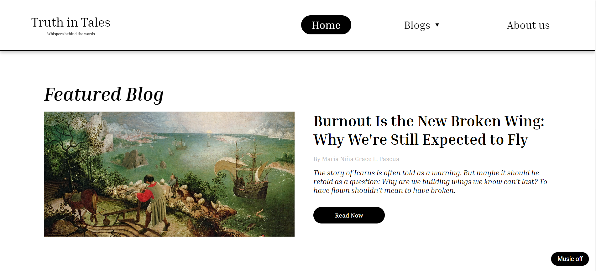

# 📖 Truth in Tales – Creative Writing Website

[](https://developer.mozilla.org/en-US/docs/Web/HTML)
[](https://developer.mozilla.org/en-US/docs/Web/CSS)
[](https://developer.mozilla.org/en-US/docs/Web/JavaScript)
[](https://pages.github.com/)

> **Truth in Tales** is a website where stories, reflections, and everyday thoughts come to life. It’s a calm space to slow down, explore real experiences, and share the quiet truths we often overlook, presented through simple design and honest writing.



---

## 📋 Overview

**Truth in Tales** is a static website showcasing essays, personal reflections, and creative writing pieces. It’s designed to be simple, readable, and visually clean so that the focus stays on the content.

Key sections include: **Blog/Essays, Home/Landing Page, and About Us**.

---

## 🛠️ Tech Stack

* **🌐 HTML5** – Structure of the website
* **🎨 CSS3** – Styling and responsive layouts
* **⚡ JavaScript** – Interactive elements (if any)
* **📦 GitHub Pages** – Deployment and hosting

---

## ✨ Features

* **📖 Clean Design** – Minimalist and reader-focused layout
* **📱 Responsive** – Optimized for desktop, tablet, and mobile
* **🖋 Creative Content** – Essays and reflections presented with clarity
* **🌙 Light & Dark Readability** – Simple styling that is easy on the eyes
* **💻 Static and Fast** – Fully client-side, no backend needed

---

## 👥 Team

| Name                         | Role                   |
| ---------------------------- | ---------------------- |
| Francine Angela G. Alejandro | UI / Frontend Designer |
| Yohanna A. Decilio           | UI / Frontend Designer |
| Shane S. Mendoza             | UI / Frontend Designer |
| Maria Niña Grace L. Pascua   | UI / Frontend Designer |
| Mark Harold T. Valderrama    | Backend / Developer    |
| Randel Angelo L. Yumul       | Backend / Developer    |

*UI team focuses on layout, typography, and user experience.*
*Backend team handles interactivity, site structure, and deployment.*

---

## 🚀 Getting Started

### Prerequisites

* A modern web browser (Chrome, Edge, Firefox, Safari, etc.)

### Viewing Locally

1. Clone the repository:

```bash
git clone https://github.com/RandelYumul/Truth_in_Tales.git
cd Truth_in_Tales
```

2. Open `blog.html` first, then `index.html`, then `about us.html` in your browser to follow the intended priority.

---

## 📁 Project Structure

```
Truth_in_Tales/
├── .github/
│   └── workflows/            # GitHub Actions workflows
├── assets/                   # Images, icons, or other asset files
├── audio/                    # Audio files used on the site
├── css/
│   └── styles.css            # Site-wide styling
├── js/
│   └── script.js             # Optional JavaScript functionality
├── pages/                    # Additional HTML pages
├── index.html                # Home page
└── README.md                 # Project documentation
```

---

## 🌐 Deployment

The website is hosted using **GitHub Pages**, making it accessible online without a backend:

**Live Site:** [https://randelyumul.github.io/Truth_in_Tales/](https://randelyumul.github.io/Truth_in_Tales/)

---

## 📞 Contact

* **GitHub:** [RandelYumul](https://github.com/RandelYumul)
* **Email:** [randel.angelo10@gmail.com](mailto:randel.angelo10@gmail.com)

---

<div align="center">
  Built with ❤️ using **HTML**, **CSS**, and **JavaScript** – hosted on **GitHub Pages**
</div>
